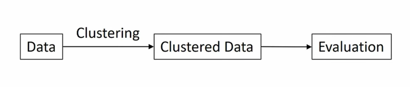

# Cyber security

## Cyber threat taxonomy tree

# Machine learning 

Machine learning learn by data. 

## Terms

### Supervised learning. 

Classifiers. Use labels to classify the data. The way supervised method works is using probabilities of previously 
observed events to infer the probabilities of new events. 

In general, the evaluation compares the `X_test` with the `Y_test` to establish if the information matches or not.

### Unsupervised learning.

Clustering. No labels. This learning clusters the data to evaluate it. These unsupervised methods draw abstractions 
from unlabeled datasets and apply these to new data.

## Concept

The most of work in machine learning will be in getting features, data sets, and data pre-processing. 
In other words, we need to become raw data in a vector space model to apply machine learning. 

## Algorithms

- Naïve bayes
- Decision tress
- Random forest
- KNN
- Linear regression
- Logistics regression
- Neural networks
- Support Vector Machines
- Deep neural networks (TensoFlow)

## Deep learning

- Neural networks with more middle layers. 
- Batch processing for big data. 

## Machine learning pipeline

- Machine learning algorithms > Use of deep learning as a main algorithm.
- Evaluation > We can measure the performance.

